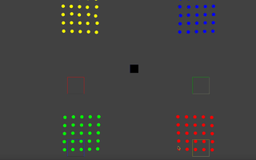
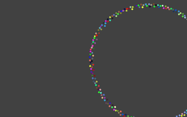

# 1. Godot RVO2

The repo uses [NavigationServer2D](https://docs.godotengine.org/en/latest/classes/class_navigationserver2d.html) to draw the progress of RVO2. based Godot v4.3dev4

RVO2 refer: https://github.com/snape/RVO2/tree/v2.0.2

## Block.cs

refer: https://github.com/snape/RVO2/blob/v2.0.2/examples/Blocks.cpp

## Circle

refer: https://github.com/snape/RVO2/blob/v2.0.2/examples/Circle.cpp

the scene add keyboard control, you can use wasd to move Camera.

